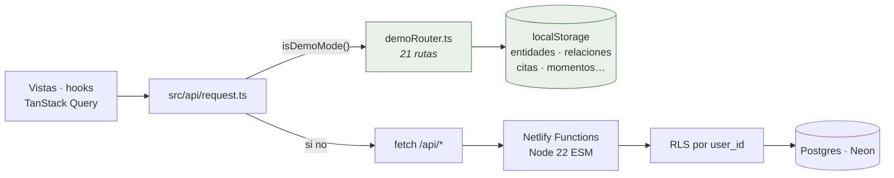
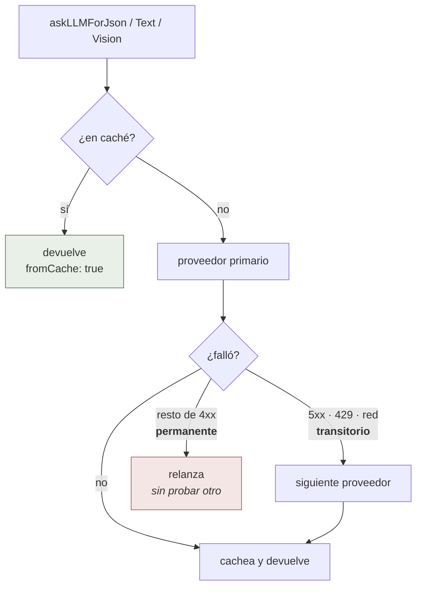
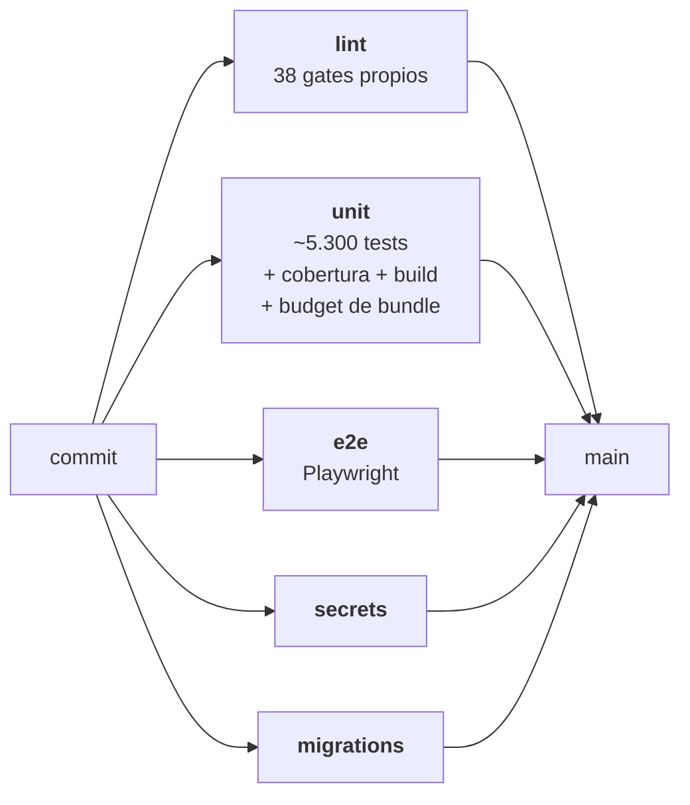

# Trama — Arquitectura

Documento vivo de decisiones. Cada bloque de mejoras lo actualiza.

## Mapa interactivo (la forma actual del sistema)

Este documento explica **por qué** el sistema es como es. Para ver **qué hay
hoy** —las 73 piezas, quién habla con quién y cómo viaja un dato de punta a
punta— abrí el mapa:

- [`docs/arquitectura/mapa.html`](docs/arquitectura/mapa.html) — diagrama
  interactivo en un solo archivo (se abre con doble clic, sin servidor). Elegí
  un flujo del panel derecho y la ruta completa se resalta sobre el diagrama.
- [`docs/arquitectura/mapa.json`](docs/arquitectura/mapa.json) — el mismo grafo
  como datos (`{nodes, edges, flows}`), pensado para que lo lea un agente.

**Por qué se puede confiar en él.** Cada nodo y cada paso de flujo cita
archivos reales, y `npm run check:architecture-map` verifica en CI que esas
~196 rutas sigan existiendo, que el grafo no tenga referencias rotas y que el
HTML no se quede con una copia vieja del JSON. Un PR que renombre un archivo
citado pone el mapa en rojo en vez de dejarlo mentir en silencio.

Para actualizarlo: editá `mapa.json` y corré `npm run architecture-map:build`
(reinyecta el grafo en el HTML y refresca los contadores de portada).

La división del trabajo entre los dos artefactos es deliberada: **el mapa
enumera** (y su gate lo mantiene honesto); **esta prosa explica decisiones**.
Donde este documento necesite un inventario, remite al mapa en vez de
duplicarlo — la prosa no tiene gate, y las listas duplicadas son exactamente
lo que envejece sin avisar.

## Visión del producto

Mapa cognitivo personal de afinidades intelectuales y estéticas, que creció
hasta ser un espacio personal con dos mundos (sección siguiente). La cara más
visible sigue siendo **el grafo**; el motor es una **IA que estructura texto
desordenado** en nodos y relaciones que el usuario revisa y confirma.
Alrededor crecieron un diario multimedia (Momentos), captura desde el bolsillo
(WhatsApp) y desde el navegador (extensión de Chrome), y un mundo utilitario
de apuntes, tareas y PDFs.

Tres pilares:

1. **Visualización primero.** El producto son las vistas, no los formularios.
2. **IA como escribano, humano como curador.** El usuario aporta texto bruto o
   un input ambiguo; la IA propone estructura; el usuario decide qué entra. La
   única excepción deliberada es la captura por WhatsApp: mandar el mensaje
   **es** la aprobación, y la curaduría fina se hace después en la app
   ([`docs/whatsapp.md`](docs/whatsapp.md)).
3. **Persistencia en la nube, durabilidad en décadas.** Diseñado para ser
   usable a lo largo de 10+ años, con respaldo exportable en cualquier momento
   (`netlify/functions/export.mts`).

Desde mediados de 2026 la app es además **multi-usuario real**: identidad con
Clerk y aislamiento por usuario en dos capas (ver decisiones abajo).

## Los dos mundos

`src/types/world.ts` define una unión cerrada: `'trama' | 'notas'`.

- **Trama** es el mundo histórico: el mapa cognitivo — grafo, entidades,
  citas, momentos, chat y sus lentes (hoy 11 vistas).
- **Notas** es una app de productividad liviana: feed de notas y recortes,
  tareas, prompts, claves cifradas en el cliente, Imprenta y Planillas (el
  editor de PDF con dos modos) y Biblioteca (hoy 8 secciones, ocultables por
  usuario).

**Por qué dos mundos y no más vistas en el sidebar.** La decisión nació al
sumar la app de apuntes: era un producto de otra naturaleza (utilitario,
frecuente, mundano) que no debía mezclarse con la navegación de un producto
contemplativo, y cada cambio suyo tenía que ser incapaz de romper el mapa
cognitivo, que quedó intacto dentro de su propio shell. Un mundo encapsula:
workspace propio, navegación propia, acento visual propio (salvia para Notas)
y datos independientes, con **puentes explícitos** en lugar de acoplamiento:
la paleta ⌘K de Trama puede saltar a un módulo de Notas, y una nota puede
promoverse a Momento.

**Qué comparten: casi todo lo estructural.** Es una sola app y un solo deploy:
mismo `QueryClient`, mismo cliente HTTP (`src/api/request.ts`), mismos Netlify
Functions con la misma auth, y el mismo chrome (el conmutador de mundos vive
en el logo — `src/components/WorldSwitcher.tsx`). El mundo activo se resuelve
con prioridad URL → `localStorage` → preferencia de servidor → Trama, y el
mundo Notas entero es un chunk lazy con precarga por intención (hover sobre el
conmutador). La paleta ⌘K existe solo en Trama; Notas tiene su buscador
propio.

Esta decisión no tuvo ADR en su momento; el porqué vivía en los docblocks de
`src/types/world.ts` y en el commit que la introdujo. Esta sección lo deja
fijado.

## Stack técnico

| Capa            | Elección                                                                               | Por qué                                                                                                                              |
| --------------- | -------------------------------------------------------------------------------------- | ------------------------------------------------------------------------------------------------------------------------------------ |
| Frontend        | React 18 + Vite + TypeScript + Tailwind                                                | Vite rápido, TS para seguridad de tipos, Tailwind para iterar estética sin CSS suelto                                                |
| Backend         | Netlify Functions (ESM, `.mts`)                                                        | Cero servidor que mantener; wrappers finos que solo declaran ruta y reexportan el handler real de `_lib/`                            |
| Base de datos   | Netlify Database (Postgres serverless vía Neon) con pgvector y FTS                     | Relacional, vectorial y texto completo en la misma base — la búsqueda híbrida y el RAG no necesitan un segundo almacén               |
| Driver Postgres | `@netlify/database` → `getSql()`                                                       | Tagged templates con parametrización segura; el wrapper propio inyecta el contexto RLS (ver decisión abajo)                          |
| Identidad       | Clerk + tokens personales (`trama_pat_*`) + modo legacy                                | Sesión real multi-usuario; el PAT cubre a la extensión (sin sesión) y el legacy cubre desarrollo local sin llaves                    |
| Storage binario | Netlify Blobs para lo chico + Cloudflare R2 firmado con `aws4fetch` para lo grande     | Las functions topan el body en ~6 MB; lo grande sube directo del navegador al bucket (ver decisión abajo)                            |
| Grafo           | SVG rico para tramas chicas + sigma.js/WebGL lazy desde ~1000 entidades                | Fidelidad visual mientras el DOM aguanta; WebGL cuando la escala lo exige ([ADR 0008](./docs/adr/0008-webgl-threshold-sigma.md))     |
| LLM             | Cuatro proveedores swappables (DeepSeek default), elegibles por usuario y por tarea    | El modelo cambia cada 6 meses; la capa de invocación no debería                                                                      |
| Embeddings      | OpenAI `text-embedding-3-small` (1536 dims) sobre pgvector con índices HNSW            | Un solo modelo de embeddings alimenta búsqueda semántica, dedupe de entidades y RAG                                                  |
| Streaming       | SSE en el hilo de chat; token a token en DeepSeek/OpenAI, un chunk en Anthropic/Gemini | Contrato de frames uniforme para el cliente, sin upgrade dance de WebSocket                                                          |
| Captura móvil   | WhatsApp vía Twilio: webhook firmado, respuesta TwiML                                  | Capturar sin abrir la app; la firma HMAC autentica a Twilio y el número vinculado autentica al usuario                               |
| Integraciones   | Spotify (OAuth + sync programado cada 3 h), X, Wikipedia                               | Fuentes externas que alimentan escuchas, bookmarks y datos de entidades — siempre como propuesta, nunca escritura directa a la trama |
| Entrega         | GitHub Actions + branch protection + canario de deploy                                 | A `main` solo por PR en verde; el canario vigila que producción sirva de verdad `origin/main` (ver decisión abajo)                   |

## Estructura del repositorio

Ver el árbol completo en [`README.md`](./README.md#layout-del-repo) y la vista
por capas en el mapa. Resumen:

- `src/` — frontend React de los dos mundos
  - `src/App.tsx` monta el shell de mundos; `src/components/ViewRouter.tsx`
    enruta las vistas de Trama (cada una lazy y con ErrorBoundary propio) y
    `src/components/notas/NotasWorld.tsx` las secciones de Notas
  - `src/state/` — un hook por dominio sobre TanStack Query, con mutaciones
    optimistas e invalidación agrupada por superficie
  - `src/api/` — cliente HTTP único + transforms snake↔camel
  - `src/hooks/` y `src/lib/` — layouts puros del grafo, motor PDF/OCR,
    compresión de imagen, modo prueba
- `extension/` — extensión de Chrome (recortes y favoritos con token personal)
- `netlify/functions/` — endpoints serverless: wrappers `.mts` finos, lógica
  compartida en `_lib/`
- `netlify/database/migrations/` — SQL versionado, inmutable una vez aplicado
- `scripts/` — gates de calidad y herramientas operacionales, con registro
  central en `scripts/script-registry.mjs`
- `e2e/` — specs de Playwright

## Modelo de datos

El inventario real —96 migraciones, cada tabla con sus índices y políticas—
vive en `netlify/database/migrations/`, y la vista por dominios en el mapa.
Acá quedan las convenciones que hacen predecible cualquier tabla nueva:

- `id UUID PRIMARY KEY` — generado por DB (`gen_random_uuid()`)
- `created_at` inmutable; `updated_at` mantenido por trigger
- `deleted_at TIMESTAMPTZ NULL` — **borrado suave**: las queries filtran
  `WHERE deleted_at IS NULL` y el DELETE es un UPDATE. Las pocas tablas
  operacionales que pueden hard-deletear están allowlisted en
  `scripts/check-hard-delete-allowlist.mjs`
- `user_id` en toda tabla privada (desde el esquema multi-usuario); un gate
  exige que cada INSERT lo incluya (ver «RLS en dos capas»)
- `origin JSONB NOT NULL DEFAULT '{"kind": "manual"}'` — procedencia
  estructurada: `manual`, `ai` (con provider, model y el id del log de
  extracción) o `imported` (con la fuente)

### Eliminación en cascada

Si una entidad se soft-deletea, también se soft-deletean sus relaciones, sus
citas y sus links a momentos — en `netlify/functions/_lib/entities-endpoint.ts`
con un único CTE atómico donde la entidad y todo su cascade comparten el mismo
`deleted_at`. No puede quedar la entidad borrada y el cascade no, y el restore
usa ese timestamp exacto para revertir solo lo que ese borrado tocó.

## Los caminos de la IA

La regla que los unifica no cambió desde el primer día: **la IA propone, el
usuario aprueba item por item**, y lo aprobado se persiste con su procedencia
en `origin`. Lo que sí creció es la cantidad de caminos: extracción desde
texto y desde imagen, sugerencia de relaciones, reclasificación de tipos,
propuestas inline del chat, sugerencias proactivas, sugerencia de destino de
un recorte, reflexión y ecos sobre citas. Las rutas exactas y sus archivos
están en el mapa (capa «Endpoints» y el flujo «Preguntar al chat»).

Dos excepciones deliberadas: la captura por WhatsApp (mandar el mensaje es la
aprobación) y la transcripción de notas de voz (Whisper convierte, no
propone).

### `_lib/llm/`

El punto único de acceso a los modelos es el directorio
`netlify/functions/_lib/llm/` (`_lib/llm.ts` sobrevive solo como barrel de
compatibilidad). Superficie pública: `askLLMForJson`, `askLLMForText`,
`askLLMForTextStreaming`, `askLLMForVision` y `askLLMForTranscription`.

- **Elección de proveedor en tres niveles**: el header `X-AI-Mode` (apagar la
  IA por completo, o forzar proveedor/modelo puntual), la tabla
  `ai_task_providers` — por usuario **y por tarea**: extract, chat, voz, etc. —
  y el default por env var.
- **Cadena de respaldo opt-in** (`netlify/functions/_lib/llm/provider-chain.ts`):
  solo ante fallo transitorio (5xx, 429, red) se pasa al siguiente proveedor,
  y solo si ese proveedor tiene key dedicada; el resto de 4xx corta la cadena
  ([ADR 0017](./docs/adr/0017-fallback-solo-ante-fallo-transitorio.md)).
- **Caché en dos niveles** por hash del input: memoria del proceso y la tabla
  `llm_cache` en Postgres (TTL default 600 s), best-effort — un fallo de caché
  nunca rompe la llamada.
- **Costos medidos siempre**: cada respuesta trae `usage` con tokens y costo
  estimado, todo gasto queda en `extraction_log`, y un tope mensual por
  usuario (`netlify/functions/_lib/cost-cap.ts`) corta con 429 **antes** de
  llamar al modelo. Sin base de datos el tope falla abierto: es contención de
  gasto, no seguridad.

## Decisiones clave y por qué

### Por qué `origin` es JSONB y no enum

Hoy distingue manual / ai / imported. Mañana queremos saber qué prompt, qué
fuente original, qué thread de chat dio origen. El enum forzaría una migración
SQL cada vez. JSONB no, y es consultable con `->`, `->>`, `@>`.

### Por qué `EntityType` y `RelationshipType` son `string` y no unions cerradas

La fuente de verdad real son las tablas `entity_types` y `relationship_types`.
Las antiguas unions literales forzaban un cast cada vez que aparecía un tipo
nuevo en la DB. Las constantes en `src/types/entity.ts` y
`src/types/relationship.ts` siguen siendo útiles para selects manuales — son
un fallback en sync con la migración seed, no la autoridad.

### Por qué los layouts del grafo son funciones puras separadas

`useGraphLayout` despacha a una de cuatro funciones puras en
`src/hooks/layouts/` (organic, byType, byYear, byDegree). Cada una recibe
nodos y aristas y devuelve `Map<id, {x,y}>`. Esto hace cada modo testeable sin
React, permite agregar modos sin tocar el resto, y evita persistir posiciones
cuando el modo no es orgánico (las otras vistas se recalculan
determinísticamente). Como el contrato es puro, el cálculo pudo moverse a un
worker (`src/hooks/layouts/layout.worker.ts`) sin cambiar ningún modo.

### Por qué snake_case en SQL y camelCase en JS

Convención dominante de cada ecosistema. En vez de quotear identificadores en
SQL o nombrar variables raras en JS, se hace transformación explícita en
`src/api/transform.ts` (cliente) y en cada `*.mts` (servidor). La frontera
está marcada.

### Por qué SVG + sigma.js en vez de un solo renderer

El grafo tiene dos necesidades distintas. Para tramas chicas, `GraphSvgCanvas`
mantiene la identidad visual: serif en nodos, sombras, halos y animaciones
sutiles. Para el grafo completo grande, `GraphCanvasSigma` usa sigma.js/WebGL
y se carga lazy desde `GraphView` cuando las entidades llegan a 1000; así el
bundle inicial no paga graphology/sigma para quien no lo necesita. Los dos
renderers consumen el mismo `Map<id, {x,y}>` de los layouts puros, así que
ajustar un layout no obliga a reescribir la capa visual.

### Por qué el PDF Studio es lazy

El editor de PDF (Imprenta/Planillas) arrastra las dependencias más pesadas
del cliente: pdf-lib, pdfjs y el OCR con tesseract. Nada de eso debe pagarlo
quien abre la app a leer una cita: el mundo Notas entero es un chunk lazy con
precarga por intención, `PdfStudioView` es lazy dentro de ese chunk, y el
motor (`src/lib/pdfStudio/`) se carga en diferido con la exportación en un
worker. Dos gates convierten la costumbre en contrato:
`scripts/pdf-lazy-entrypoints.mjs` verifica que ningún chunk del PDF se cuele
en la carga inicial, y el presupuesto de bundle
(`scripts/check-bundle-size.mjs`) corre en CI después del build. Cuando un
chunk excede su presupuesto, el arreglo es hacer lazy la pieza pesada — no
subir el presupuesto.

### Por qué R2 además de Netlify Blobs

Las Netlify Functions topan el body en ~6 MB, y con Blobs cada byte pasa por
la función al subir y al servir. Para fotos comprimidas y anexos chicos eso
está bien; para un video o un PDF de 80 MB no hay función que alcance. La
salida: el cliente corta en 4 MB (en `src/api/momentos.ts` y
`src/api/biblioteca.ts`, después de comprimir) — lo chico va por multipart a
Blobs; lo grande pide una URL firmada (`netlify/functions/_lib/r2.ts`, con
`aws4fetch`) y sube **directo del navegador al bucket**; el servidor solo
firma, confirma con un HEAD y registra. Al servir, lo chico responde bytes
desde la función y lo grande redirige a un GET firmado de vida corta.

El manifiesto `storage_assets` registra qué archivo vive en qué proveedor
(dominio, dueño, checksum): la fuente de verdad para autorizar, servir y
detectar huérfanos (`docs/storage-orphans.md`). Y la frontera está gateada:
`scripts/storage-boundaries.mjs` mantiene `@netlify/blobs` importable solo
desde el adapter (más un script operacional allowlisted), para que una
migración futura de proveedor sea un swap y no una cirugía
([ADR 0013](./docs/adr/0013-storage-provider-migration-sequencing.md)).

Como las storage keys nacen aleatorias y nunca se reescriben, la media privada
se sirve `private, max-age=31536000, immutable`
(`netlify/functions/_lib/media-cache.ts`); los redirects firmados van
`no-store` porque expiran.

### Por qué RLS en dos capas

El aislamiento entre usuarios no depende de que alguien recuerde un `WHERE`.
Capa uno, aplicación: todo INSERT a tabla privada debe incluir `user_id` — lo
exige el gate `scripts/user-id-write-contracts.mjs` — y las lecturas filtran
explícito. Capa dos, base de datos: las tablas privadas tienen
`FORCE ROW LEVEL SECURITY` con políticas sobre `app.current_user_id`, que
`netlify/functions/_lib/user-rls.ts` inyecta vía `set_config(..., true)` **en
la misma transacción** que la query protegida — obligatorio porque el driver
HTTP de Neon no conserva sesión entre queries. El contexto del usuario viaja
por AsyncLocalStorage desde la auth hasta el SQL, así que ningún call site
tiene que acordarse de pasarlo.

La redundancia es el punto: el filtro de aplicación protege contra bugs
obvios, pero no contra la query nueva que olvida el filtro; con RLS esa query
devuelve vacío en vez de datos ajenos
([ADR 0010](./docs/adr/0010-rls-privacy-boundary.md)). La capa dos también
está gateada: `scripts/auth-rls-contracts.mjs` exige ENABLE + FORCE + política
real por cada tabla que la requiere (una `USING (true)` no cuenta). El límite
está declarado en el ADR: esto no es cifrado de extremo a extremo ni protege
del operador de la infraestructura.

### Por qué la auth resuelve en tres niveles

`netlify/functions/_lib/auth.ts` intenta primero el **token personal**
(`trama_pat_*`, guardado solo como sha256): es lo que usa la extensión de
Chrome, que no tiene sesión de navegador — y un PAT inválido corta con 401 en
vez de caer a otro modo, porque eso sería escalar a otra cuenta. Con Clerk
configurado se valida el JWT de **Clerk** (la identidad real). Sin Clerk
configurado, la app opera en modo **legacy single-user** — así el repo corre
local sin llaves —, y en producción ese modo solo revive como opt-in explícito
(`ALLOW_LEGACY_FALLBACK`). El cutover progresivo de single-user a Clerk
estricto, con sus invariantes, está contado en
[ADR 0011](./docs/adr/0011-legacy-identity-cutover.md).

### Por qué localStorage como fallback en vez de error duro

Permite trabajar local sin desplegar el backend. Es un fallback de un solo
sentido (no sube a la nube cuando vuelve la conexión) — temporal hasta migrar
a un modelo local-first real con CRDTs. No confundir con el **modo prueba**
([ADR 0015](./docs/adr/0015-modo-prueba-backend-en-el-navegador.md)), que es
otra cosa: un backend completo en el navegador para recorrer la app sin
cuenta.

### Por qué `getSql()` y no leer la connection string directo

La integración `@netlify/database` resuelve la conexión internamente
(`NETLIFY_DB_URL`); `netlify/functions/_lib/db.ts` la envuelve en un
`getSql()` que devuelve el cliente HTTP de Neon **ya consciente del contexto
RLS**. Un solo punto de entrada a la base significa que el aislamiento por
usuario no se puede esquivar por accidente en un call site nuevo.

### Por qué SSE en vez de WebSocket para el chat

El único endpoint que streamea es el del hilo de chat: un POST normal cuya
respuesta es `text/event-stream`, que el cliente lee con
`fetch().body.getReader()`. SSE es one-way (servidor → cliente) y atraviesa
proxies/CDN sin configuración; WebSocket añadiría un upgrade dance que no
hace falta, porque el mensaje del usuario ya viaja en el POST. El streaming
token a token existe en DeepSeek/OpenAI; Anthropic y Gemini responden hoy en
un único chunk con el mismo contrato de frames, así el consumidor no distingue
proveedores.

### Por qué Netlify Database (Neon) y no Supabase, Turso, etc.

Provisionada automáticamente con la extensión. Plan Pro de Netlify incluye uso
gratuito hasta cierto volumen. El driver es estándar (Neon HTTP) — migrar a
otro Postgres es swap del wrapper en `netlify/functions/_lib/db.ts` y de la
env var. Que pgvector y FTS vivan en la misma base evitó un almacén vectorial
aparte.

### Por qué existe el canario de deploy

En julio de 2026 producción quedó **un mes** clavada en un commit viejo con
todo en verde: CI pasaba, Netlify construía cada merge, el deploy figuraba
`ready` — y un `locked: true` silencioso impedía publicar. Ningún check miraba
lo único que importa: qué commit está de verdad en línea. Desde entonces el
build publica un `version.json` con su sha dentro del artefacto (servido sin
caché) y una sonda cada 6 horas (`scripts/deploy-canary.mjs`) lo compara
contra `origin/main`; si producción quedó atrás, el workflow falla y abre un
issue. Mide conducta observable —lo que el CDN sirve—, sin secretos ni API de
Netlify, porque esa fue la única señal que el incidente validó como fiable.

## Cómo desplegar

1. PR contra `main`. La branch protection exige los cinco checks de CI en
   verde y la rama al día; no hay push directo ni excepción para admins
   ([`docs/deploy.md`](docs/deploy.md)).
2. Al mergear, Netlify construye: guard de producción
   (`scripts/check-legacy-fallback-prod.mjs`), build, sello de versión
   (`scripts/write-version.mjs`) y las migraciones nuevas antes de publicar.
3. El canario (`.github/workflows/deploy-canary.yml`) vigila cada 6 horas que
   lo servido sea de verdad `origin/main`.
4. Variables de entorno requeridas: ver
   [`README.md`](./README.md#variables-de-entorno-en-netlify-dashboard).

## Cómo aplicar una migración

1. Crear directorio: `netlify/database/migrations/<unix_timestamp>_<slug>/migration.sql`
2. Escribir SQL (idempotente cuando sea posible: `CREATE TABLE IF NOT EXISTS`,
   `ALTER TABLE ... ADD COLUMN IF NOT EXISTS`).
3. Push a `main`. Netlify aplica antes del próximo build.
4. **Las migraciones aplicadas son inmutables** — no editar, siempre agregar
   nuevas. Netlify rechaza el deploy si una migración previamente registrada
   cambió de hash.

## Testing

Vitest, con `npm test` (el runner del repo es `scripts/run-vitest.mjs`).
Convenciones que no cambiaron: tests **colocados** con su código (`foo.ts` →
`foo.test.ts`), sin globals, mocks con `vi.stubGlobal` y limpieza en
`afterEach`. Lo que sí cambió desde la primera versión de este documento: los
componentes React se testean con Testing Library sobre happy-dom (cientos de
archivos colocados en `src/`), hay tests de integración de backend contra
Postgres real, y specs e2e de Playwright en `e2e/`. El qué-se-testea ya no
cabe en una tabla — los números vivos están en la portada del mapa.

### CI

`.github/workflows/test.yml` corre cinco jobs en paralelo sobre cada push y
PR: `lint` (eslint + los gates propios), `unit` (suite + cobertura + build +
presupuesto de bundle), `e2e`, `secrets` y `migrations` (con un Postgres real
y tests de integración). `pdf-visual` corre aparte, filtrado por paths, y por
eso no es check requerido. A `main` solo se llega por PR con los cinco checks
en verde: hay branch protection sin excepción para admins.

## Cosas conscientemente aplazadas

La lista canónica —documentada para no re-litigar— vive en
[`docs/conventions/roadmap.md`](docs/conventions/roadmap.md). Una muestra del
espíritu: CRDTs recién cuando haya dos dispositivos editando en simultáneo,
xyflow solo si algún día se quiere un grafo editable a mano, streaming nativo
de Anthropic/Gemini cuando alguno sea proveedor de producción.

## La forma del sistema, de un vistazo

Tres diagramas para lo que cuesta entender leyendo prosa. El resto de este
documento entra en el detalle.

### 1. La bifurcación que hace única a esta app

`src/api/request.ts` decide, en una línea, si la petición sale a la red o se
queda en el navegador. Todo lo que hay por encima —vistas, hooks, transforms—
no sabe en qué modo está.

La rama verde es el **modo prueba**: un backend completo dentro del navegador.
Devuelve formas de servidor (`snake_case`), así que los transforms de
`src/api/` corren igual que contra Postgres. Es lo que permite abrir la app con
[`?demo=1`](https://tramahub.app/?demo=1) sin cuenta ni base de datos, y lo que
hace deterministas los e2e. El porqué está en
[ADR 0015](./docs/adr/0015-modo-prueba-backend-en-el-navegador.md).

### 2. La cadena de proveedores de IA

La regla que la gobierna no es «reintenta hasta que alguno responda»: es
**transitorio cae, permanente no**.

La clasificación es **por código HTTP**, con el 429 como excepción deliberada:
va con los transitorios aunque sea un 4xx. El resto de 4xx se tratan como
permanentes porque la causa típica —credencial o petición inválida— no se
arregla cambiando de proveedor, y recorrer la cadena gastaría una llamada
facturada por eslabón enterrando el error real.

Esa clasificación por código es una aproximación, y su límite está declarado en
[ADR 0017](./docs/adr/0017-fallback-solo-ante-fallo-transitorio.md): un
proveedor que devuelva 400 ante una sobrecarga temporal no tendrá reserva, y un
429 por cuota mensual agotada recorrerá la cadena entera para nada.

### 3. Lo que hay entre un commit y `main`

Los gates no son lint genérico: comprueban invariantes de **este** proyecto —
escrituras con `user_id`, contratos de RLS, tokens de diseño, ratchets
estructurales, presupuesto de bundle, índice de ADR—. La lista vive en
`scripts/script-registry.mjs`.

## Las decisiones, una por una

Este documento describe **cómo está montado**. El **porqué** de cada decisión
costosa de revertir vive en [`docs/adr/`](./docs/adr/), con su contexto, sus
alternativas descartadas y sus consecuencias negativas declaradas.

Última revisión: 2026-08-05
