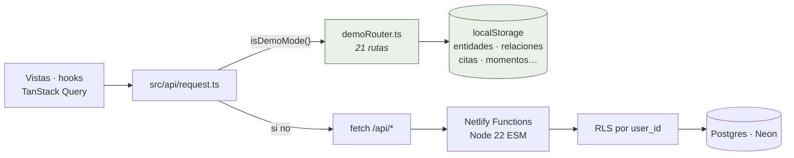
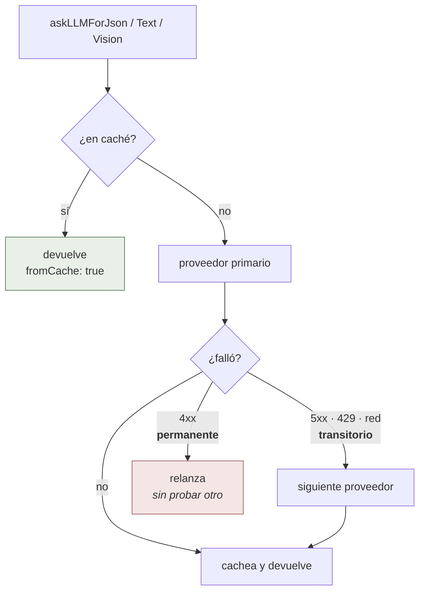

# Trama — Arquitectura

Documento vivo de decisiones. Cada bloque de mejoras lo actualiza.

## Visión del producto

Mapa cognitivo personal de afinidades intelectuales y estéticas. La cara visible es **un grafo**; el motor es una **IA que estructura texto desordenado** en nodos y relaciones que el usuario revisa y confirma. Una pestaña paralela de chat permite conversar con la trama y recibir sugerencias inline.

Tres pilares:

1. **Visualización primero.** El producto es el grafo, no los formularios.
2. **IA como escribano, humano como curador.** El usuario aporta texto bruto o un input ambiguo; la IA propone estructura; el usuario decide qué entra. Nunca nada automático.
3. **Persistencia en la nube, durabilidad en décadas.** Diseñado para ser usable a lo largo de 10+ años, con respaldo exportable en cualquier momento.

## Stack técnico

| Capa            | Elección                                                                                          | Por qué                                                                                                                                                         |
| --------------- | ------------------------------------------------------------------------------------------------- | --------------------------------------------------------------------------------------------------------------------------------------------------------------- |
| Frontend        | React 18 + Vite + TypeScript + Tailwind                                                           | Vite rápido, TS para seguridad de tipos, Tailwind para iterar estética sin CSS suelto                                                                           |
| Hosting         | Netlify                                                                                           | El usuario ya tiene cuenta Pro, despliegues automáticos en push a `main`, scheduled functions incluidas                                                         |
| Backend         | Netlify Functions (Node 22, ESM)                                                                  | Cero servidor que mantener, escala automática, idéntico stack TS que el frontend                                                                                |
| Base de datos   | Netlify Database (Postgres serverless via Neon)                                                   | Provisionado por Netlify, plan Pro incluye uso gratuito hasta cierto volumen                                                                                    |
| Driver Postgres | `@netlify/database` → `getSql()`                                                                  | Resuelve la conexión vía la extensión Netlify Database. Bajo el capó usa `@neondatabase/serverless` (HTTP), tagged template literals con parametrización segura |
| Streaming       | SSE para chat con DeepSeek/OpenAI; fallback de un chunk para Anthropic/Gemini                     | Token-by-token donde el provider lo soporta; API consumer-side uniforme                                                                                         |
| Grafo           | SVG rico para tramas chicas + sigma.js WebGL lazy para tramas grandes                             | Mantiene fidelidad visual bajo ~1000 nodos y cambia a WebGL cuando el grafo completo cruza el umbral de escala                                                  |
| LLM             | Abstracción multi-proveedor: DeepSeek por defecto, OpenAI/Anthropic/Gemini swappables vía env var | El modelo cambia cada 6 meses; la capa de invocación no debería                                                                                                 |
| Spotify         | OAuth client + scheduled function de sync                                                         | Importa playlists y registra escuchas, sin escribir nada a la trama sin aprobación                                                                              |
| Sync local      | localStorage como fallback offline (unidireccional)                                               | Temporal; migrar a CRDTs (Yjs) cuando se use en múltiples dispositivos                                                                                          |

## Estructura del repositorio

Ver el árbol completo en [`README.md`](./README.md#layout-del-repo). Resumen:

- `src/` — frontend React
  - `App.tsx` — shell con sidebar + canvas + paneles. Coordina state global mínimo (vista activa, entidad seleccionada, propuesta pendiente)
  - `state/` — hooks granulares por dominio sobre TanStack Query
  - `hooks/layouts/` — funciones puras de cálculo de posiciones (organic, byType, byYear, byDegree)
  - `components/` — vistas (GraphView, EntitiesView, QuotesView, RelationshipsView, ListeningView, ChatView) + paneles (NodeDetailPanel, ProposalPanel, ReclassifyPanel)
- `netlify/functions/` — endpoints serverless
  - `_lib/` — utilidades reutilizables: conexión DB, LLM, prompts, validators, observabilidad
  - `*.mts` — handlers HTTP, uno por endpoint o grupo de paths
- `netlify/database/migrations/` — SQL versionado aplicado por Netlify en deploy

## Modelo de datos

Tablas centrales y sus relaciones:

```
entities (1) ─── (∞) relationships ─── (1) entities
        │
        └── (∞) quotes

chat_threads (1) ─── (∞) chat_messages
spotify_tokens (single row, id='default')
spotify_plays
entity_types, relationship_types        ← catálogos (datos, no código)
extraction_log, error_log               ← observabilidad
```

### Convenciones de columnas

Las tablas de dominio incluyen:

- `id UUID PRIMARY KEY` — generado por DB (`gen_random_uuid()`)
- `created_at TIMESTAMPTZ NOT NULL DEFAULT NOW()` — inmutable
- `updated_at TIMESTAMPTZ NOT NULL DEFAULT NOW()` — actualizado por trigger en cada UPDATE
- `deleted_at TIMESTAMPTZ NULL` — soft delete (las queries filtran por `WHERE deleted_at IS NULL`)
- `origin JSONB NOT NULL DEFAULT '{"kind": "manual"}'` — procedencia estructurada (ver abajo)

Excepciones: `chat_messages` no tiene `updated_at`/`deleted_at` (es append-only y la borrada cae por CASCADE del thread). `spotify_plays` ídem.

### Tabla `entities`

Además de las columnas estándar:

- `type TEXT NOT NULL` — slug del tipo (referencia lógica a `entity_types.slug`, no FK estricta)
- `name TEXT NOT NULL`
- `year INTEGER NULL` — año asociado (nacimiento, publicación, lanzamiento)
- `description TEXT NULL` — descripción libre, una frase corta
- `position_x DOUBLE PRECISION NULL`, `position_y DOUBLE PRECISION NULL` — coordenadas para el modo de layout orgánico
- `spotify_url TEXT NULL` — link público de Spotify para entidades musicales (banda, musico, cancion, album, disco)

Tipos de entidad seedados (24): persona, escritor, filósofo, músico, banda, director, artista, científico, libro, ensayo, poema, artículo, canción, podcast, álbum, disco, película, serie, documental, obra, concepto, idea, lugar, evento.

### Tabla `relationships`

- `from_id UUID NOT NULL REFERENCES entities(id) ON DELETE CASCADE`
- `to_id UUID NOT NULL REFERENCES entities(id) ON DELETE CASCADE`
- `type TEXT NOT NULL` — slug del tipo de relación
- `notes TEXT NULL` — justificación o contexto

Tipos seedados (8): influye_en, cita_a, responde_a, me_llego_por, suena_como, inspira, contradice, asociado_con.

### Tabla `quotes`

- `entity_id UUID NOT NULL REFERENCES entities(id) ON DELETE CASCADE`
- `text TEXT NOT NULL`
- `source TEXT NULL` — referencia bibliográfica o URL
- `context TEXT NULL` — comentario sobre la cita

Las notas rápidas que el usuario añade desde `NodeDetailPanel` son quotes sin `source`/`context`.

### Tablas de chat

`chat_threads`: id, title (auto-generado por LLM tras el primer mensaje), timestamps, soft delete.

`chat_messages`: thread_id (FK con CASCADE), role (`'user' | 'assistant'`), content, proposal (JSONB), tokens_in/out/cost_cents (per-message), provider/model. Append-only.

### Tablas Spotify

`spotify_tokens`: una sola fila id='default'. Guarda access_token, refresh_token, expires_at, scope, profile.

`spotify_plays`: cada reproducción con track_id, artist_ids[], album_id, played_at. Unique en (track_id, played_at) para que el sync sea idempotente.

### El campo `origin`

JSONB con esta forma mínima:

```json
{ "kind": "manual" }
```

O cuando viene de la IA:

```json
{
  "kind": "ai",
  "provider": "deepseek",
  "model": "deepseek-chat",
  "extractionLogId": "uuid-del-log-de-extraccion"
}
```

O cuando viene de un import (Spotify, archivo JSON):

```json
{
  "kind": "imported",
  "importedFrom": "spotify"
}
```

JSONB porque: (a) flexible para agregar campos sin migración, (b) consultable con operadores `->`, `->>`, `@>`, (c) preparado para nuevas fuentes futuras (`pdf`, `voice`, etc.).

### Eliminación en cascada

Si una entidad se soft-deletea (`deleted_at` se setea), también se soft-deletean sus relaciones (entrantes y salientes), sus citas y sus links a momentos. Esto se hace en `netlify/functions/_lib/entities-endpoint.ts` con un único CTE atómico: la entidad y todo su cascade comparten un mismo `deleted_at` (la CTE `ts`), de modo que no puede quedar la entidad borrada pero el cascade no. El restore usa ese timestamp exacto para revertir solo lo que ese borrado tocó.

## El flujo principal de la IA

Hay cinco caminos donde la IA produce sugerencias estructuradas:

1. **Extract** (`POST /api/extract`) — texto libre → entidades + relaciones + citas.
2. **Suggest relationships** (`POST /api/suggest-relationships`) — recorre la trama y propone vínculos nuevos entre entidades existentes.
3. **Reclassify** (`POST /api/reclassify-entities`) — revisa los tipos actuales y propone cambios cuando hay uno mejor en el catálogo.
4. **Chat** (`POST /api/chat/threads/:id/messages`, SSE) — diálogo persistido con la trama completa como contexto. La respuesta puede traer un bloque JSON entre marcadores `<<<TRAMA-PROPOSAL ... TRAMA-PROPOSAL>>>` que el cliente parsea en propuestas inline.
5. **Import playlist Spotify** (`POST /api/spotify/import-playlist`) — la "IA" aquí es determinística (no LLM): parsea el ID de la URL, llama Spotify API, agrupa por artista único y devuelve una propuesta.

Todos los caminos terminan en el mismo flujo: la UI muestra una propuesta y el usuario aprueba/rechaza por item. Las que aprueba se persisten con `origin.kind = 'ai'` (o `'imported'` para playlist).

### `_lib/llm.ts`

Punto único de entrada al LLM. Tres funciones:

- `askLLMForJson(messages)` — fuerza `response_format: json_object`. Para extract/suggest/reclassify.
- `askLLMForText(messages)` — texto plano. Para chat (no-streaming) y para auto-título de threads.
- `askLLMForTextStreaming(messages)` — async generator de `{chunk|done|error}` frames. SSE en DeepSeek/OpenAI; fallback de un solo chunk en Anthropic/Gemini.

Cada función:

- Lee provider y key de env vars
- Cachea por hash del input (TTL configurable, default 600s)
- Hace retry con backoff en 5xx/429, no en 4xx
- Devuelve `{ content, usage, fromCache }` — usage incluye costo estimado y tokens

## Decisiones clave y por qué

### Por qué `origin` es JSONB y no enum

Hoy distingue manual / ai / imported. Mañana queremos saber qué prompt, qué fuente original, qué thread de chat dio origen. El enum forzaría una migración SQL cada vez. JSONB no.

### Por qué `EntityType` y `RelationshipType` son `string` y no unions cerradas

La fuente de verdad real son las tablas `entity_types` y `relationship_types`. Las antiguas unions literales forzaban un cast cada vez que aparecía un tipo nuevo en la DB. Las constantes `ENTITY_TYPES` (en `src/types/entity.ts`) y `RELATIONSHIP_TYPES` (en `src/types/relationship.ts`) siguen siendo útiles para los selects manuales — son un fallback en sync con la migración seed, no la verdad.

### Por qué los layouts del grafo son funciones puras separadas

`useGraphLayout(mode, nodes, edges)` despacha a una de cuatro funciones puras en `src/hooks/layouts/`. Cada una recibe `LayoutNode[]` + `LayoutEdge[]` y devuelve `Map<id, {x,y}>`. Esto:

- hace cada modo testeable sin React,
- permite agregar un modo nuevo (radial, jerárquico, por color, etc.) sin tocar el resto,
- evita persistir posiciones cuando el modo no es orgánico (las otras vistas se recalculan determinísticamente).

### Por qué snake_case en SQL y camelCase en JS

Convención dominante de cada ecosistema. En vez de quotear identificadores en SQL o nombrar variables raras en JS, se hace transformación explícita en `src/api/transform.ts` (cliente) y en cada `*.mts` (servidor). La frontera está marcada.

### Por qué SVG + sigma.js en vez de un solo renderer

El grafo tiene dos necesidades distintas. Para tramas chicas, `GraphSvgCanvas`
mantiene la identidad visual: serif en nodos, sombras, halos, labels y
animaciones sutiles. Para el grafo completo grande, `GraphCanvasSigma` usa
sigma.js/WebGL y se carga lazy desde `GraphView` cuando `entities.length >=
1000`; así el bundle inicial no paga graphology/sigma para usuarios que no lo
necesitan.

Los layouts siguen siendo funciones puras (`useGraphLayout` y
`src/hooks/layouts/*`). Los dos renderers consumen el mismo `Map<id, {x,y}>`, así
que ajustar un layout no obliga a reescribir la capa visual.

### Por qué localStorage como fallback en vez de error duro

Permite trabajar local sin desplegar el backend. Es un fallback de un solo sentido (no sube a la nube cuando recuperas conexión) — temporal hasta migrar a un modelo local-first real con CRDTs.

### Por qué `getSql()` y no leer `NETLIFY_DATABASE_URL` directo

La extensión heredada `@netlify/neon` fue retirada por Netlify y la env var `NETLIFY_DATABASE_URL` dejó de inyectarse. La integración nueva (`@netlify/database`) expone `getDatabase()` que resuelve la conexión vía `NETLIFY_DB_URL` internamente. `_lib/db.ts` envuelve esto en un `getSql()` que devuelve el `httpClient` de Neon — el mismo tagged-template literal de antes, ningún cambio en los call sites.

### Por qué SSE en vez de WebSocket para el chat

SSE es one-way (servidor → cliente) y soporta proxies/CDN sin configuración. El cliente lee chunks con `fetch().body.getReader()`. WebSocket añadiría un upgrade dance que no necesitamos: el usuario manda un mensaje vía POST normal, el servidor responde con el stream.

### Por qué Netlify Database (Neon) y no Supabase, Turso, etc.

Provisionada automáticamente con la extensión. Plan Pro de Netlify incluye uso gratuito hasta cierto volumen. El driver es estándar (Neon HTTP) — migrar a otro Postgres es swap del wrapper en `_lib/db.ts` y de la env var.

## Cómo desplegar

1. Push a `main` en GitHub.
2. Si el sitio Netlify está conectado al repo, deploy automático.
3. En primer deploy: Netlify detecta migraciones nuevas y las aplica antes de servir.
4. Variables de entorno requeridas en Netlify (ver [`README.md`](./README.md#variables-de-entorno-en-netlify-dashboard)).

## Cómo aplicar una migración

1. Crear directorio: `netlify/database/migrations/<unix_timestamp>_<slug>/migration.sql`
2. Escribir SQL (idempotente cuando sea posible: `CREATE TABLE IF NOT EXISTS`, `ALTER TABLE ... ADD COLUMN IF NOT EXISTS`).
3. Push a `main`. Netlify aplica antes del próximo build.
4. **Las migraciones aplicadas son inmutables** — no editar, siempre agregar nuevas. Netlify rechaza el deploy si una migración previamente registrada cambió de hash.

## Testing

Vitest corre tests con `npm test`. Configuración en `vitest.config.ts`.

### Convenciones

- Tests **colocados** con su código: `foo.ts` → `foo.test.ts` en la misma carpeta.
- Patrones incluidos: `src/**/*.test.ts` y `netlify/**/*.test.ts`.
- Sin globals (`globals: false`): cada test importa `describe, it, expect, vi` de `vitest`.
- Mocks de `fetch`/`Netlify.env` con `vi.stubGlobal`, limpieza en `afterEach`.

### Qué se testea

| Archivo                                                   | Qué cubre                                                                                                                                                       |
| --------------------------------------------------------- | --------------------------------------------------------------------------------------------------------------------------------------------------------------- |
| `netlify/functions/_lib/llm.ts`                           | Dispatch correcto por proveedor (DeepSeek/OpenAI/Anthropic/Gemini), headers y body shape por API, parsing de respuestas, manejo de errores y env vars faltantes |
| `netlify/functions/_lib/extract-validate.ts`              | Validación de tipo, dedup case-insensitive contra existentes, rechazo de self-loops, input malformado                                                           |
| `netlify/functions/_lib/reclassify-prompt.ts`             | El prompt menciona todos los tipos, todas las entidades, exige catálogo y conservadurismo                                                                       |
| `netlify/functions/_lib/reclassify-validate.ts`           | Drop de items sin entity match, type no válido, no-op (mismo tipo), reason opcional                                                                             |
| `netlify/functions/_lib/suggest-relationships-prompt.ts`  | Prompt lista entidades + citas + relaciones existentes; demanda justificación                                                                                   |
| `netlify/functions/_lib/chat-validate.ts`                 | Parse del marker `<<<TRAMA-PROPOSAL ... TRAMA-PROPOSAL>>>`, tolerancia a JSON malformado, detección de propuestas vacías                                        |
| `src/api/transform.ts`                                    | Transforms snake↔camel, normalización de `origin` legacy                                                                                                        |
| `src/storage.ts`                                          | LocalStorage round-trip, tolerancia a JSON corrupto                                                                                                             |
| `src/hooks/layouts/byType.ts`, `byYear.ts`, `byDegree.ts` | Cada layout: nodos posicionados, clustering correcto, edge cases                                                                                                |

Componentes React de momento se prueban end-to-end con `npm run dev`.

### CI

`.github/workflows/test.yml` corre en cada push y PR a `main`:

1. `npm ci`
2. `npm run typecheck` (tsc -b)
3. `npm test`
4. `npm run build`

Una falla en cualquier paso aparece como check rojo. No hay branch protection forzando passing en este momento.

## Cosas conscientemente aplazadas

- **Local-first sync con CRDTs (Yjs/Automerge).** Vale la pena cuando se use en 2+ dispositivos en simultáneo. Hoy localStorage es solo fallback unidireccional.
- **Auth real (Netlify Identity).** Hoy se protege con site password. Si el alcance crece más allá de personal, considerar.
- **Interacciones avanzadas del grafo.** Sigma ya cubre el modo WebGL de escala. Si más adelante hacen falta conexiones manuales, edición directa de aristas o nodos tipo canvas, evaluar `xyflow` como una capa distinta, no como reemplazo automático del renderer actual.
- **UI de gestión de tipos de entidad y relación.** Las tablas y endpoints existen; falta el formulario.
- **UI del extraction log.** El endpoint `/api/extraction-log` existe. Falta la vista de costos / historial.
- **Tests de componentes UI con React Testing Library.** El scaffold de Vitest está; agregar `@testing-library/react` cuando se quiera cubrir UI.
- **Búsqueda dentro del chat.** Los hilos están en DB; falta vista de búsqueda.
- **Streaming en Anthropic/Gemini.** Por ahora fallback de un chunk. Cuando se use uno de esos providers en producción, agregar el SSE específico.

## La forma del sistema, de un vistazo

Tres diagramas para lo que cuesta entender leyendo prosa. El resto de este
documento entra en el detalle.

### 1. La bifurcación que hace única a esta app

`src/api/request.ts` decide, en una línea, si la petición sale a la red o se
queda en el navegador. Todo lo que hay por encima —vistas, hooks, transforms—
no sabe en qué modo está.



La rama verde es el **modo prueba**: un backend completo dentro del navegador.
Devuelve formas de servidor (`snake_case`), así que los transforms de
`src/api/` corren igual que contra Postgres. Es lo que permite abrir la app con
[`?demo=1`](https://tramahub.app/?demo=1) sin cuenta ni base de datos, y lo que
hace deterministas los e2e. El porqué está en
[ADR 0015](./docs/adr/0015-modo-prueba-backend-en-el-navegador.md).

### 2. La cadena de proveedores de IA

La regla que la gobierna no es «reintenta hasta que alguno responda»: es
**transitorio cae, permanente no**.



Un 4xx es una clave mala o una petición inválida: probar otro proveedor no lo
arregla, gasta una llamada facturada por eslabón y entierra el error real. El
porqué, en [ADR 0017](./docs/adr/0017-fallback-solo-ante-fallo-transitorio.md).

### 3. Lo que hay entre un commit y `main`


Los gates no son lint genérico: comprueban invariantes de **este** proyecto —
escrituras con `user_id`, contratos de RLS, tokens de diseño, ratchets
estructurales, presupuesto de bundle, índice de ADR—. La lista vive en
`scripts/script-registry.mjs`.

## Las decisiones, una por una

Este documento describe **cómo está montado**. El **porqué** de cada decisión
costosa de revertir vive en [`docs/adr/`](./docs/adr/), con su contexto, sus
alternativas descartadas y sus consecuencias negativas declaradas.

Última revisión: 2026-05-21
